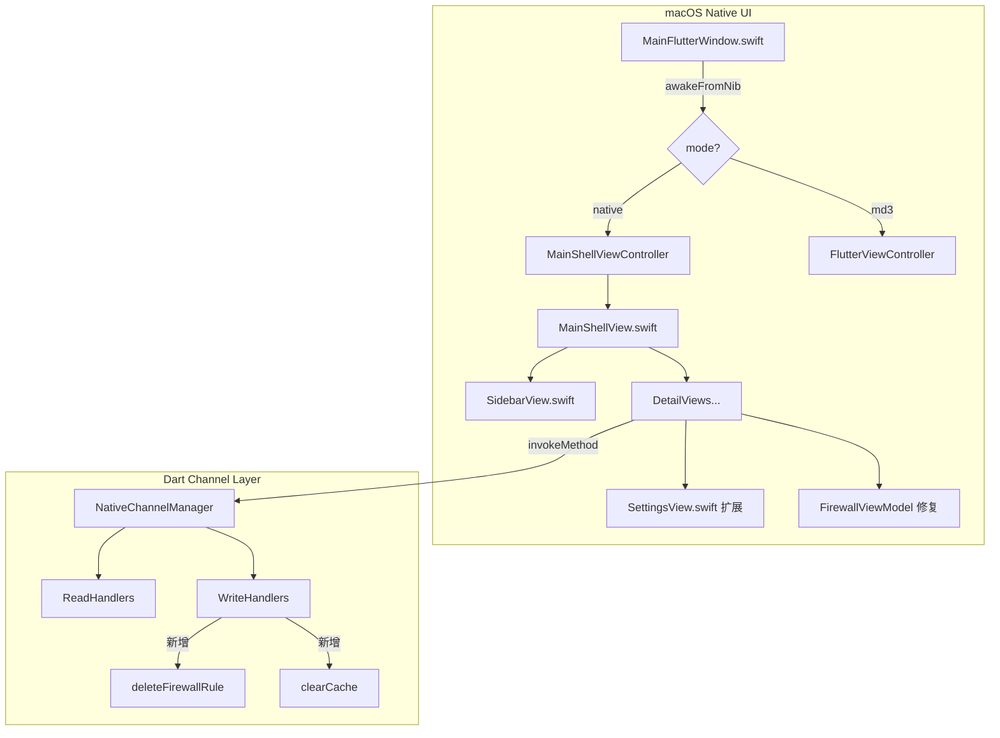

## 用户需求

修复并完善 macOS 原生 UI（Native 模式）下的多个问题，使其与 MDUI3 功能对齐（同时保留 MDUI3 切换能力）。

## 产品概览

1Panel Client macOS 客户端支持两种 UI 渲染模式：Flutter/MDUI3 渲染模式 和 原生 SwiftUI 渲染模式。当前原生模式下存在多个可见 Bug 和功能缺失。

## 核心问题及功能

### 问题1：侧边栏翻译缺失（当前显示原始 key 字符串）

- `SidebarView.swift` 中 `navDashboard`、`navDatabases`、`navFirewall`、`navCronjob`、`navBackup`、`navAi` 这 6 个 key 与 arb 文件不匹配
- 需要将 key 对齐为 arb 中已存在的正确 key（如 `serverModuleDashboard`、`serverModuleDatabases` 等）
- `navCronjob`、`navBackup` 在 arb 中不存在，需新增（中文：计划任务 / 备份）

### 问题2：标题栏透明（无材质背景）

- `MainFlutterWindow.swift` 中 `configureVisualEffectWindow()` 将 `isOpaque = false` + `backgroundColor = .clear` 导致窗口完全透明
- 需按渲染模式分别处理：Native 模式下保留系统默认毛玻璃标题栏材质，md3 模式下保持原有透明设置

### 问题3：表格空白行问题

- `Table` 视图在数据量少时显示大量空白占位行
- 需确保表格只显示实际数据行，不预设固定行高

### 问题4：`deleteFirewallRule` channel 方法未注册

- `FirewallViewModel.swift` 调用了 `deleteFirewallRule`，但 Dart 侧 `NativeChannelManager` 及 `NativeChannelWriteHandlers` 中均未实现此方法
- 需在 Dart 侧补充实现并注册

### 功能5：设置页对齐 MDUI3

- 当前 `SettingsView.swift` 仅有 UI 渲染模式切换，缺少通用（主题、语言、应用锁）、存储（缓存设置）、支持与反馈（反馈中心、法律文件、关于）等分区
- 需参照 MDUI3 的 `SettingsPage` 结构，使用 macOS 原生 SwiftUI Form 风格重建设置页面

## 技术栈

- **Swift / SwiftUI**：macOS 原生 UI 层（`macos/Runner/`）
- **Dart / Flutter**：核心业务逻辑、Channel 通信层（`lib/core/channel/`）
- **ARB**：国际化翻译文件（`lib/l10n/`）

## 实现方案

### 总体策略

按问题严重程度分层修复：先修通信链路（deleteFirewallRule 注册、标题栏透明），再修 UI 表现（翻译 key、空行问题），最后扩展设置页面功能。所有修改严格遵循现有架构——Dart 层写业务逻辑，Swift 层只做 UI + Channel 调用。

### 关键决策

#### 标题栏修复（问题2）

`configureVisualEffectWindow()` 目前无条件设置了 `backgroundColor = .clear` + `isOpaque = false`，这是根本原因。修复方案：**在 `configureVisualEffectWindow()` 中去掉 `isOpaque = false` 和 `backgroundColor = .clear`，只保留 `titlebarAppearsTransparent = true` + `titleVisibility = .hidden`**，而 `MainShellViewController.viewWillAppear` 中的 `.fullSizeContentView` 保持不变，这样 SwiftUI 的 `NavigationSplitView` toolbar 区域会自动获得系统侧边栏材质背景。如果需要 md3 模式下彻底透明，则在 `awakeFromNib` 的回调里根据 mode 判断后再单独调用透明化逻辑。

#### 翻译 Key 修复（问题1）

采用 A+B 方案：修改 `SidebarView.swift` 使用已存在的正确 key（`serverModuleDashboard`、`serverModuleDatabases`、`serverModuleFirewall`、`serverModuleAi`、`serverModuleWebsites`、`serverModuleContainers`、`serverModuleApps`、`serverModuleMonitoring`），同时在 arb 文件中补充 `navCronjob`（计划任务）和 `navBackup`（备份）两个新 key，并更新 `DashboardView`/`DatabasesView`/`FirewallView`/`AIView` 的 `navigationTitle` 调用也使用正确 key。

#### 空行问题（问题3）

macOS `Table` 视图在 `.inset` 样式下天然不会补空行，当前截图出现空行的原因是数据加载完成但行数固定（macOS 14 之前 Table 对空数据会显示占位格）。解决方案：在 `Table` 外部做 `if viewModel.servers.isEmpty` 判断已有，核心问题在于加载时 `ProgressView` 被跳过而直接渲染空 Table → 需确保 `isLoading` 状态正确持有到数据返回后才解除。另外对 `Table` 添加 `.rowHeight(44)` 并去掉固定 frame 约束即可避免多余占位。

#### deleteFirewallRule 修复（问题4）

在 `NativeChannelWriteHandlers.dart` 中新增 `deleteFirewallRule` handler，通过 `FirewallService` 的已有 API 实现。在 `NativeChannelManager.dart` 的 dispatch switch 中注册该 case。由于 `FirewallService` 的删除接口需要 port + protocol + address 复合参数，Swift 端 `FirewallViewModel` 的 `deleteRule` 也需要将完整规则信息传递过去。

#### 设置页扩展（问题5）

参照 MDUI3 `SettingsPage` 的四个分区结构，用 SwiftUI `Form` + `Section` 重建 `SettingsView.swift`：

- **通用**：主题（跳转子页/Sheet）、语言（Picker）、UI 渲染模式（RadioGroup，现有功能保留）、应用锁（开关）
- **存储**：缓存设置（通过 Channel 调用清除缓存）
- **支持与反馈**：反馈中心（打开 URL）、法律文件（显示文本）、关于（版本信息）
- 导航采用 macOS 惯用的 `NavigationLink` + `NavigationStack` 子页模式

## 实现注意事项

- **不破坏 MDUI3**：`MainFlutterWindow` 的透明配置修改只影响窗口初始化阶段，md3 分支在 `awakeFromNib` 回调中单独补充 `backgroundColor = .clear` + `isOpaque = false`，保证 MDUI3 液态玻璃效果不受影响
- **`deleteFirewallRule` 参数设计**：Swift 端 `FirewallRuleModel` 已包含 port/protocol/address/strategy 字段，`deleteRule` 调用时将完整规则 dict 传递给 Dart，Dart 端通过 `FirewallService.deleteRule` 实现，避免仅传 id 导致 API 错误
- **arb 文件补充**：新增的 `navCronjob`/`navBackup` key 需同时在 `app_zh.arb` 和 `app_en.arb` 中添加，且遵循已有 key 命名规范
- **SettingsViewModel 扩展**：新增语言读取和清缓存功能，通过 `ChannelManager.invokeDataMethod("getSettings")` 获取当前语言设置，通过 `ChannelManager.invokeDataMethod("clearCache")` 执行清缓存（需在 Dart 侧补充此 handler）
- **LOC 限制**：`SettingsView.swift` 扩展后若超过 500 行，需拆分子视图（如 `SettingsAboutView.swift`、`SettingsGeneralSection.swift`）

## 架构设计



## 目录结构

```
修改文件汇总：

macos/Runner/
├── MainFlutterWindow.swift              # [MODIFY] 修复标题栏：configureVisualEffectWindow 去掉 isOpaque=false/backgroundColor=.clear；md3 模式回调中补充透明化
├── MainShellViewController.swift        # [MODIFY] viewWillAppear 中区分 native/md3 模式，native 模式不设置 titlebarAppearsTransparent
└── UI/
    ├── Modules/
    │   ├── Shell/
    │   │   └── SidebarView.swift        # [MODIFY] 修复6个翻译key：使用serverModuleDashboard/serverModuleDatabases/serverModuleFirewall/serverModuleAi等正确key
    │   ├── Dashboard/
    │   │   └── DashboardView.swift      # [MODIFY] navigationTitle 改用 serverModuleDashboard key
    │   ├── Databases/
    │   │   └── DatabasesView.swift      # [MODIFY] navigationTitle 改用 serverModuleDatabases key
    │   ├── Firewall/
    │   │   ├── FirewallView.swift       # [MODIFY] navigationTitle 改用 serverModuleFirewall key
    │   │   └── FirewallViewModel.swift  # [MODIFY] deleteRule 传递完整 port/protocol/address/strategy 参数
    │   ├── AI/
    │   │   └── AIView.swift             # [MODIFY] navigationTitle 改用 serverModuleAi key
    │   ├── Servers/
    │   │   └── ServersView.swift        # [MODIFY] 修复空白行：移除固定行数约束，确保 isLoading 状态正确
    │   ├── CronJobs/
    │   │   └── CronJobsView.swift       # [MODIFY] navigationTitle 改用 operationsCronjobsTitle key
    │   ├── Backups/
    │   │   └── BackupsView.swift        # [MODIFY] navigationTitle 改用 operationsBackupsTitle key
    │   └── Settings/
    │       ├── SettingsView.swift       # [MODIFY] 重建为对齐 MDUI3 的4分区设置页（通用/存储/支持与反馈/应用）
    │       └── SettingsViewModel.swift  # [MODIFY] 新增语言读取、清缓存功能

lib/
├── l10n/
│   ├── app_zh.arb                       # [MODIFY] 新增 navCronjob=计划任务, navBackup=备份 两个 key
│   └── app_en.arb                       # [MODIFY] 新增 navCronjob=Cronjobs, navBackup=Backups 两个 key
└── core/channel/
    ├── native_channel_manager.dart      # [MODIFY] 注册 deleteFirewallRule 和 clearCache 两个新 case
    ├── native_channel_write_handlers.dart # [MODIFY] 新增 deleteFirewallRule handler（调用 FirewallService）
    └── native_channel_read_handlers.dart  # [MODIFY] 新增 clearCache handler（清除本地缓存）
```

## Agent Extensions

### SubAgent

- **code-explorer**
- 用途：在实施 deleteFirewallRule handler 时，需要搜索 FirewallService 的 deleteRule API 签名和参数结构，以及确认 BackupRecordService、CronjobService 等 service 层的现有方法签名，避免参数不匹配
- 预期输出：确认各 Service 删除方法的准确参数类型，确保 Dart 侧 write handler 实现正确无遗漏