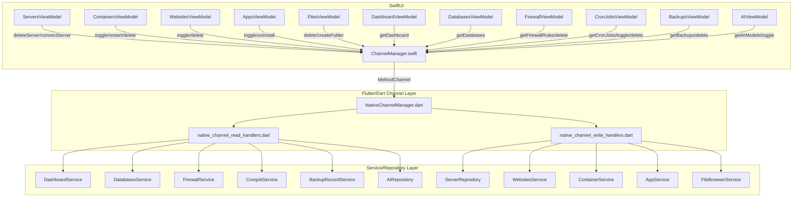

## 用户需求

macOS 原生 SwiftUI 端当前与 Dart 层的 Method Channel 存在严重功能缺口：6 个模块的 read 操作完全依赖 Mock 数据（Dashboard、数据库、防火墙、定时任务、备份、AI），11 个写操作均为 no-op（服务器删除/切换、网站开关/删除、容器操作、应用操作、文件操作）。需要完整打通双端通信，实现 macOS 原生 UI 与真实 1Panel 数据的高度可用。

## 产品概览

- 补全 Dart 侧 `NativeChannelManager` 的 6 个缺失 Read handlers，桥接已有的 Service/Repository 层
- 补全 Dart 侧 11 个缺失 Write handlers，并统一返回成功/失败结构给 Swift
- 升级 12 个 Swift ViewModel，将所有 no-op/mock 替换为真实 Channel 调用，并加入正确的错误处理和状态刷新逻辑
- 因 `NativeChannelManager` 补全后会突破 500 行推荐阈值，需按职责域拆分为多个子文件

## 核心功能

- **Read 通道补全**：getDashboard（CPU/内存/磁盘/系统信息/运行时长）、getDatabases（MySQL/PostgreSQL/Redis 列表）、getFirewallRules（端口/协议/策略规则列表）、getCronJobs（定时任务列表+下次执行时间）、getBackups（备份记录列表）、getAIModels（Ollama 模型列表）
- **Write 通道补全**：deleteServer/connectServer、toggleWebsiteStatus/deleteWebsite、toggleContainerState/restartContainer/deleteContainer、toggleAppStatus/uninstallApp、deleteFile/createFolder，所有写操作统一返回 `{success: bool, error: String?}` 结构
- **Swift ViewModel 升级**：12 个 ViewModel 全部替换 Mock/no-op，改为调用 ChannelManager，写操作后自动刷新列表并通过 `@Published var errorMessage` 向 UI 暴露错误信息
- **文件拆分**：将 `native_channel_manager.dart` 按模块域拆分为 read handlers 文件和 write handlers 文件，主文件保持 dispatch 路由职责

## 技术栈

- 现有项目：Flutter/Dart + SwiftUI，Method Channel 双向通信
- Dart 侧：Provider 状态管理，Service/Repository 分层架构
- Swift 侧：SwiftUI + ObservableObject ViewModel，`@Published` 属性驱动 UI

## 实现方案

### 整体策略

采用"Dart 侧集中扩展 + Swift 侧逐一激活"的双端并行策略：先在 Dart 侧 `NativeChannelManager` 补全所有 handler（Read + Write），再逐步替换 Swift ViewModel 中的 no-op/mock 实现。两侧改动互不阻塞，可分步验证。

### Dart 侧文件拆分策略

当前 `native_channel_manager.dart` 为 187 行，补全后将达到约 450-500 行（每个 handler 约 15-20 行）。为遵守项目 500 行推荐阈值，按职责拆分为三个文件：

```
lib/core/channel/
├── native_channel_manager.dart        # [MODIFY] 主路由器，保留 dispatch switch，引入子模块
├── native_channel_read_handlers.dart  # [NEW] 所有 Read handlers（getDashboard 等 6 个新增 + 已有迁移）
└── native_channel_write_handlers.dart # [NEW] 所有 Write handlers（11 个新增）
```

主文件只保留 `init()` + `_handleMethodCall()` switch，所有实现下沉到对应 handler 文件的 static 方法。

### Write Handler 统一返回协议

所有写操作统一返回 Map 结构，Swift 侧按此解析：

```
// 成功
return {'success': true};
// 失败  
return {'success': false, 'error': e.toString()};
```

### Swift ViewModel 升级模式

将 no-op 替换为真实 Channel 调用，统一加入 `@Published var errorMessage: String?` 和 `@Published var isProcessing: Bool`，写操作完成后自动调用 fetch 刷新。

### 关键 Service 方法映射（已验证）

| Channel case | Dart Service 方法 | 备注 |
| --- | --- | --- |
| `getDashboard` | `DashboardService().loadDashboardData()` | 返回 DashboardData |
| `getDatabases` | `DatabasesService().loadPage(scope: DatabaseScope.mysql, ...)` | 需遍历多个 scope |
| `getFirewallRules` | `FirewallService().searchRules(page:1, pageSize:100)` | 返回 PageResult |
| `getCronJobs` | `CronjobService().searchCronjobs(CronjobListQuery(...))` | 有 nextHandlePreview |
| `getBackups` | `BackupRecordService().loadRecords()` | 返回 List |
| `getAIModels` | `AIRepository().searchOllamaModels(page:1, pageSize:50)` | 返回 PageResult |
| `deleteServer` | `ServerRepository().removeConfig(id)` | 删除本地配置 |
| `connectServer` | `ServerRepository().setCurrent(id)` | 切换当前服务器 |
| `toggleWebsiteStatus` | `WebsitesService().startWebsite/stopWebsite(id)` | 根据 currentStatus 判断 |
| `deleteWebsite` | `WebsitesService().deleteWebsite(id)` | id 需 int 转换 |
| `toggleContainerState` | `ContainerService().startContainer/stopContainer(id)` | 根据 state 判断 |
| `restartContainer` | `ContainerService().restartContainer(id)` | 直接调用 |
| `deleteContainer` | `ContainerService().removeContainer(id)` | 直接调用 |
| `toggleAppStatus` | `AppService().operateApp(id, 'start'/'stop')` | id 需 int 转换 |
| `uninstallApp` | `AppService().uninstallApp(installId)` | String installId |
| `deleteFile` | `FileBrowserService().deleteFiles([path])` | 需判断 isDir |
| `createFolder` | `FileBrowserService().createDirectory(path)` | path 含完整路径 |


## 实现注意事项

- **getDatabases**：需遍历 `DatabaseScope.values`（mysql/postgresql/redis/remote），对每个 scope 调用 `loadPage`，合并结果列表后返回；单次请求可能失败需 try-catch 每个 scope
- **FirewallService 依赖 `clientManager`**：需用 `runGuarded()` 包裹，确保当前服务器已配置，否则返回空列表而非异常
- **id 类型安全**：Swift 传来的 id 可能为 `String`（container id）或 `int`（website id），Dart 侧必须做类型转换并加断言
- **写操作不阻塞主线程**：Channel handler 本身已在 Dart event loop，无需额外 isolate；但 Swift 侧调用 `async` 方法需在 `Task {}` 中执行
- **LOC 控制**：read_handlers 预计约 200 行，write_handlers 预计约 220 行，主文件约 60 行，均在限制内
- **不修改 ChannelManager.swift**（Swift 侧基础设施已修复），只改各 ViewModel

## 架构设计



## 目录结构

```
lib/core/channel/
├── native_channel_manager.dart         # [MODIFY] 精简为 dispatch 路由 + init，约 60 行
├── native_channel_read_handlers.dart   # [NEW] Read handlers 静态工具类，包含已有的 getContainers/getServers 等全部迁移过来 + 6 个新增，约 200 行
└── native_channel_write_handlers.dart  # [NEW] Write handlers 静态工具类，包含 11 个新增写操作，约 220 行

macos/Runner/UI/Modules/
├── Servers/ServersViewModel.swift          # [MODIFY] 替换 deleteServer/connectServer 为真实 Channel 调用
├── Containers/ContainersViewModel.swift    # [MODIFY] 替换 toggle/restart/delete 三个 no-op
├── Websites/WebsitesViewModel.swift        # [MODIFY] 替换 toggle/delete 两个 no-op
├── Apps/AppsViewModel.swift                # [MODIFY] 替换 toggle/uninstall 两个 no-op
├── Files/FilesViewModel.swift              # [MODIFY] 替换 deleteFile/createFolder 两个 no-op
├── Dashboard/DashboardViewModel.swift      # [MODIFY] 替换 mock 为真实 getDashboard Channel 调用
├── Databases/DatabasesViewModel.swift      # [MODIFY] 替换 mock 为真实 getDatabases，补全 deleteDatabase
├── Firewall/FirewallViewModel.swift        # [MODIFY] 替换 mock 为真实 getFirewallRules，补全 deleteRule
├── CronJobs/CronJobsViewModel.swift        # [MODIFY] 替换 mock 为真实 getCronJobs，补全 toggle/delete
├── Backups/BackupsViewModel.swift          # [MODIFY] 替换 mock 为真实 getBackups，补全 delete
└── AI/AIViewModel.swift                    # [MODIFY] 替换 mock 为真实 getAIModels，补全 toggle
```

## Agent Extensions

### SubAgent

- **code-explorer**
- 用途：在实现 Write handlers 时，精确探查 `AppService.operateApp`、`CronjobService.updateStatus/delete`、`BackupRecordService.deleteRecord`、`FirewallService.deleteRules` 等方法的完整签名和所需参数模型，确保参数构造正确
- 预期结果：获取所有 Write handler 所需的精确方法签名和参数类型，避免运行时类型错误